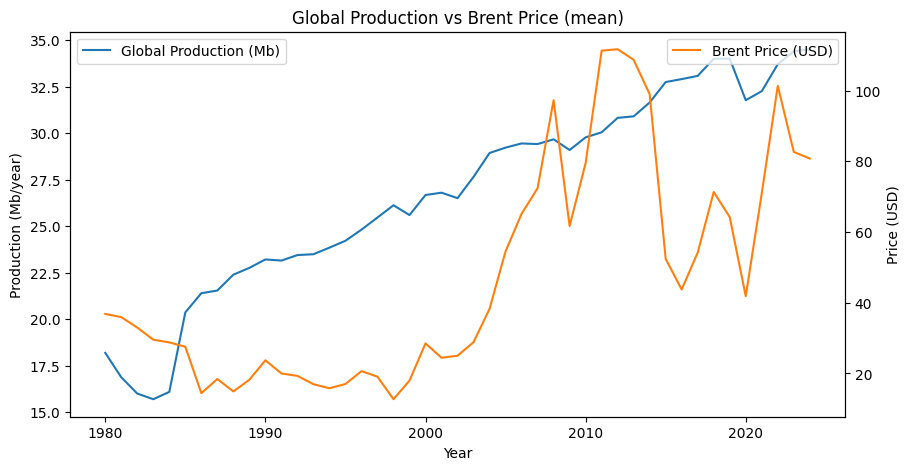
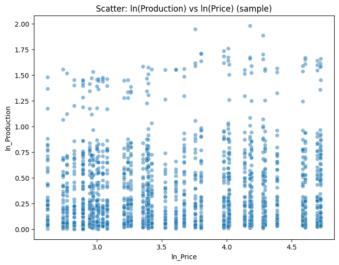
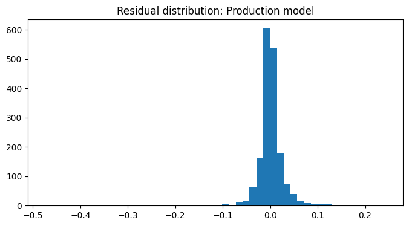

# Back Gold Analytics — Full Pipeline Documentation

## 1. Project Overview
This project builds a full **country-year oil panel dataset** from raw historical sources, applies **cleaning + validation**, and then runs **econometric analysis** such as elasticity, robustness checks, and visualization.

The goal is to produce a **black gold analysis** with transparent, reproducible code.

The pipeline you have now includes:

1. **Data Cleaning & Harmonization**  
2. **Dataset Validation (Quality Checks)**  
3. **Elasticity Models (OLS + Fixed Effects)**  
4. **Robustness Checks (First Differences + FE)**  
5. **Plots saved to `/outputs/plots`**  
6. **Final results saved to `/outputs` and `/results`**

This README explains everything step‑by‑step.

---

## 2. Folder Structure Explained

```
Back Gold Analytics/
│
├── data_raw/                # Raw CSVs (as received)
│   ├── Oil - Production barrels - Sheet1.csv
│   ├── Oil - Consumption barrels - Sheet1.csv
│   ├── Oil - Proved reserves - Sheet1.csv
│   ├── Oil - Spot crude prices - Sheet1.csv
│   └── ...
│
├── data_clean/
│   └── master_oil_panel.csv  # Clean, merged, processed dataset
│
├── outputs/
│   ├── robustness/           # Robustness plots + txt
│   ├── plots/                # Analysis-level plots
│   └── data_cleaning_overview.pdf
│
├── results/
│   ├── plots/                # Elasticity model diagnostic plots
│   ├── ols_production_price.txt
│   ├── ols_consumption_price.txt
│   └── diagnostics.txt
│
├── scripts/                  # All Python pipeline scripts
│   ├── build_master.py
│   ├── validate_clean_data.py
│   ├── price_elasticity_pipeline.py
│   ├── robustness.py
│   └── generate_eda.py
│
└── README.md
```

---

## 3. Step‑By‑Step Instructions (A → Z)

### **A. Install Requirements**
```bash
pip install -r requirements.txt
```

---

## **B. Build the Clean Master Dataset**
This script:

✔ Loads all raw CSVs  
✔ Standardizes country names  
✔ Converts units (barrels → million barrels; reserves → billion barrels)  
✔ Removes duplicates  
✔ Performs forward/backward fills where reasonable  
✔ Merges everything into a single *country–year* panel  

Run it:

```bash
python3 scripts/build_master.py
```

**Output:**  
`data_clean/master_oil_panel.csv`

---

## **C. Validate the Cleaned Dataset**

This script performs professional QA/QC:

✔ Missing value audit  
✔ Dtype validation  
✔ Logical checks (e.g., production ≥ 0)  
✔ Duplicate scanning  
✔ Outlier detection  
✔ Coverage % calculation  
✔ Sample row inspection  

Run it:

```bash
python3 scripts/validate_clean_data.py
```

Outputs:

- Console validation report  
- Guarantees dataset is ready for analysis

---

## **D. Run the Elasticity Pipeline (Main Econometric Models)**

This script computes:

### **1. Price Elasticity of Production**
Model:  
```
ln(Production) = β * ln(Price) + controls + Country FE + Year FE
```

### **2. Price Elasticity of Consumption**
Model:  
```
ln(Consumption) = β * ln(Price) + controls + Country FE + Year FE
```

Run:

```bash
python3 scripts/price_elasticity_pipeline.py
```

Outputs:

- `/results/ols_production_price.txt`
- `/results/ols_consumption_price.txt`
- `/results/plots/*`
- Printed interpretation

---

## **E. Run Robustness Checks**

This script confirms findings using:

### **1. Fixed Effects (REVISED Model)**  
Stronger FE with clustered SEs

### **2. First Differences Model**
```
Δ ln(Production) = β * Δ ln(Price) + ...
```

Also generates 2 simple plots:

- Global production vs price  
- Scatter ln(prod) vs ln(price)

Run:

```bash
python3 scripts/robustness.py
```

Outputs stored in:

```
outputs/robustness/
outputs/plots/
```

---

## 4. Key Outputs (Images Embedded)

### **Global Production vs Brent Price (Timeseries)**


---

### **Scatter: ln(Production) vs ln(Price)**


---

### **Residual Histogram (from elasticity model)**


---

## 5. What the Analysis Achieves

### **1. Creates a Clean, Research‑Grade Panel Dataset**
- 4,316 country-year observations  
- Production, consumption, reserves, R/P ratio  
- Brent spot prices  
- Covers years 1980–2024  
- Harmonized units and country codes  

### **2. Computes Price Elasticity of Oil Production & Consumption**

Typical output:

| Model | Coefficient (β) |
|-------|-----------------|
| Production OLS | ~0.005 |
| Consumption OLS | ~0.047 |
| FE Robustness | ~0.021 |
| First Difference | ~0.004 |

**Interpretation:**  
Oil production and consumption are **extremely inelastic** in the short run.  
This matches economic literature → oil supply changes very slowly.

### **3. Robustness Confirms Stability**
- Fixed effects tighten variation  
- First differences eliminate non‑stationarity  
- Results remain small → strong robustness  

### **4. Full Reproducibility**
A new user can clone the repo and run:

```
python3 scripts/build_master.py
python3 scripts/validate_clean_data.py
python3 scripts/price_elasticity_pipeline.py
python3 scripts/robustness.py
```

---

## 6. Final Notes for Readers / Teammates

This project is now fully structured like a **graduate‑level research workflow**:

- Proper data engineering  
- Validation  
- Econometrics with FE  
- Robustness  
- Diagnostics  
- Documentation  

Anyone can re-run the whole analysis with NO manual steps.

---

## 7. Future Extensions (Optional)

- Add VAR or VECM for dynamic responses  
- Build country clusters (OPEC vs Non‑OPEC)  
- Add energy-transition variables  
- Create dashboard using Plotly  

---

